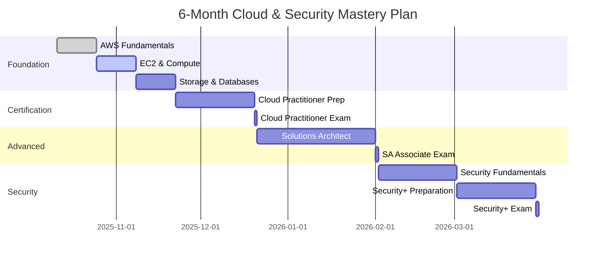

<div align="center">

<!-- Animated Header -->


<!-- Typing Animation -->
<a href="https://git.io/typing-svg"></a>

<br/>

<!-- Compact Badges -->
<p>
  <a href="https://www.linkedin.com/in/sylvester-abekah-78b2bb36a/"></a>
  <a href="mailto:sylvestertech.sly@gmail.com"></a>
  <a href="https://github.com/sylvester-thsly"></a>
  
</p>

</div>

<!-- Animated Divider -->


<br/>

## 🎯 Mission Statement

> *"At 16, I'm not just learning cloud computing—I'm architecting my future. This profile documents my transformation from curious learner to certified cloud professional through disciplined, documented, and deliberate practice."*

**Location:** Hamburg, Germany 🇩🇪  
**Status:** Day 2 of 180 | Week 1 of 26  
**Objective:** Production-ready cloud engineer by Q2 2026

<br/>

<!-- Three Column Layout -->
<table>
<tr>
<td width="33%" valign="top">

### 📚 Current Focus
```yaml
phase: Foundation
week: 1/26
module: EC2 Compute
daily_hours: 2-3
commitment: 6_days/week
progress: 8%
next_milestone: "Cloud Practitioner"
```

</td>
<td width="33%" valign="top">

### 🎓 Certifications
```json
{
  "active": "AWS Cloud Practitioner",
  "target": "Dec 2025",
  "next": [
    "AWS Solutions Architect",
    "CompTIA Security+"
  ],
  "timeline": "6 months"
}
```

</td>
<td width="33%" valign="top">

### 🔥 Commitment
```python
def daily_routine():
    learn_theory(90)  # mins
    hands_on_lab(60)
    document_github(15)
    return "Consistency > Intensity"
```

</td>
</tr>
</table>

<br/>

<!-- Animated Divider -->


## 💼 Technical Proficiency

<div align="center">

<!-- Skills organized by category -->
<table>
<tr>
<td align="center" width="25%">

<br><strong>Amazon Web Services</strong>
<br><sub>EC2 • S3 • Lambda • VPC</sub>
<br><sub>IAM • CloudWatch • RDS</sub>
</td>
<td align="center" width="25%">

<br><strong>Python</strong>
<br><sub>Automation</sub>
<br><sub>Scripting • Boto3</sub>
</td>
<td align="center" width="25%">

<br><strong>JavaScript</strong>
<br><sub>Web Development</sub>
<br><sub>Node.js • APIs</sub>
</td>
<td align="center" width="25%">

<br><strong>Linux</strong>
<br><sub>System Admin</sub>
<br><sub>Bash • CLI</sub>
</td>
</tr>
<tr>
<td align="center" width="25%">

<br><strong>Git & GitHub</strong>
<br><sub>Version Control</sub>
<br><sub>Collaboration</sub>
</td>
<td align="center" width="25%">

<br><strong>Docker</strong>
<br><sub>Learning Phase</sub>
<br><sub>Containers</sub>
</td>
<td align="center" width="25%">

<br><strong>Terraform</strong>
<br><sub>Planned</sub>
<br><sub>IaC</sub>
</td>
<td align="center" width="25%">

<br><strong>Security</strong>
<br><sub>Fundamentals</sub>
<br><sub>Best Practices</sub>
</td>
</tr>
</table>

</div>

<br/>

<!-- Animated Divider -->


## 🚀 Featured Repository

<div align="center">

<a href="https://github.com/sylvester-thsly/cloud-security-learning-journey">
  
</a>

</div>

### 📂 Project Pipeline

<table>
<tr>
<td width="50%">

#### 🌐 Phase 1: Foundation
```
├─ 📄 Static Website (S3 + CloudFront)
│  └─ ETA: Week 2
│
├─ 🖥️ WordPress Deployment (EC2 + RDS)
│  └─ ETA: Week 3-4
│
└─ 🔐 Secure IAM Architecture
   └─ ETA: Week 4
```

</td>
<td width="50%">

#### ⚡ Phase 2: Advanced
```
├─ 🔌 Serverless REST API (Lambda)
│  └─ ETA: Week 6
│
├─ 📊 Real-time Analytics Pipeline
│  └─ ETA: Week 8
│
└─ 🔄 Auto-Scaling Web Application
   └─ ETA: Week 10
```

</td>
</tr>
</table>

<br/>

<!-- Animated Divider -->


## 📊 Performance Metrics

<div align="center">

<!-- GitHub Stats - More reliable configuration -->


<!-- Animated Divider -->


## 🎯 Learning Roadmap

<div align="center">



</div>

<br/>

<!-- Animated Divider -->


## 📈 Progress Tracking

<div align="center">

<table>
<tr>
<td align="center" width="33%">
<h3>📅 Timeline</h3>

<br/>
<sub>26 weeks total program</sub>
</td>
<td align="center" width="33%">
<h3>📚 Course Progress</h3>

<br/>
<sub>Cloud Practitioner track</sub>
</td>
<td align="center" width="33%">
<h3>🔥 Daily Streak</h3>

<br/>
<sub>Consistent daily practice</sub>
</td>
</tr>
</table>

### 📅 This Week's Milestones

| Day | Milestone | Status |
|:---:|:---------|:------:|
| Mon | ✅ AWS Account + Module 1 | 🟢 Complete |
| Tue | 🔄 EC2 Fundamentals | 🟡 In Progress |
| Wed | 📝 EC2 Instance Types | ⬜ Pending |
| Thu | 🚀 Launch First EC2 | ⬜ Pending |
| Fri | 🌐 S3 Introduction | ⬜ Pending |
| Sat | 🛠️ Mini Project | ⬜ Pending |

</div>

<br/>

<!-- Animated Divider -->


## 💡 Philosophy & Approach

<div align="center">

<table>
<tr>
<td align="center" width="33%">

### 🎓 Learn
**Theory First**

Understanding fundamentals before implementation

*AWS Docs • Courses • Best Practices*

</td>
<td align="center" width="33%">

### 🔨 Build
**Apply Knowledge**

Hands-on projects with real-world scenarios

*Labs • Projects • Deployments*

</td>
<td align="center" width="33%">

### 📝 Document
**Share Publicly**

Complete transparency in the learning journey

*GitHub • LinkedIn • Daily Logs*

</td>
</tr>
</table>

</div>

### 🎯 Core Principles

```python
learning_methodology = {
    "consistency": "Daily practice beats weekend cramming",
    "documentation": "If it's not documented, it didn't happen",
    "hands_on": "Build projects, don't just watch tutorials",
    "public_learning": "Share progress, help others, stay accountable",
    "quality": "Deep understanding > Surface-level completion",
    "patience": "Master fundamentals before advanced concepts"
}
```

<br/>

<!-- Animated Divider -->


## 🏆 Achievements & Recognition

<div align="center">

<!-- Trophy Case -->


### 🎖️ Upcoming Certifications

<table>
<tr>
<td align="center">

<br/><b>AWS Cloud Practitioner</b>
<br/><sub>Target: Dec 2025</sub>
</td>
<td align="center">

<br/><b>Solutions Architect</b>
<br/><sub>Target: Feb 2026</sub>
</td>
<td align="center">

<br/><b>Security+</b>
<br/><sub>Target: Apr 2026</sub>
</td>
</tr>
</table>

</div>

<br/>

<!-- Animated Divider -->


## 📚 Resources & Learning Path

<div align="center">

| Resource | Purpose | Status | Hours Invested |
|:--------:|:-------:|:------:|:--------------:|
| 📖 [AWS Skill Builder](https://skillbuilder.aws) | Cloud Practitioner | 🟢 Active | 5 hrs |
| 🎥 [freeCodeCamp AWS](https://youtube.com/freecodecamp) | Supplementary | 🟢 Active | 2 hrs |
| 📄 [AWS Documentation](https://docs.aws.amazon.com) | Reference | 🟢 Active | 1 hr |
| 🎯 [TryHackMe](https://tryhackme.com) | Security Labs | 🟡 Planned | - |
| 📺 [Professor Messer](https://professormesser.com) | Security+ | 🟡 Planned | - |

</div>

<br/>

<!-- Animated Divider -->


## 📞 Connect & Collaborate

<div align="center">

<table>
<tr>
<td align="center" width="33%">

### 💼 Professional

[](https://www.linkedin.com/in/sylvester-abekah-78b2bb36a/)

*Weekly progress updates*  
*Professional networking*

</td>
<td align="center" width="33%">

### 📧 Direct Contact

[](mailto:sylvestertech.sly@gmail.com)

*Collaboration inquiries*  
*Questions & discussions*

</td>
<td align="center" width="33%">

### 💻 Code & Projects

[](https://github.com/sylvester-thsly)

*Daily commits*  
*Project repositories*

</td>
</tr>
</table>

### 🤝 Open to

```yaml
- Collaboration on cloud/security projects
- Learning together with fellow students
- Mentorship from experienced professionals
- Feedback on my learning approach
- Networking with the tech community
```

</div>

<br/>

<!-- Animated Divider -->


<div align="center">

## 💭 Inspiration

<table>
<tr>
<td>

*"The only way to do great work is to love what you do."*  
**— Steve Jobs**

</td>
</tr>
<tr>
<td>

*"Learning is not attained by chance; it must be sought for with ardor and attended to with diligence."*  
**— Abigail Adams**

</td>
</tr>
</table>

<br/>

### 🌟 Current Status

```javascript
const currentStatus = {
  mode: "Learning & Building",
  focus: "100%",
  coffee: "☕☕☕",
  motivation: "📈 Maximum",
  next_milestone: "First EC2 deployment",
  availability: "Open to opportunities Q2 2026"
};
```

<br/>

---

<sup>**Built with dedication** | **Updated daily** | **Hamburg, Germany** 🇩🇪</sup>

<br/>

<!-- Animated Footer -->


</div>
